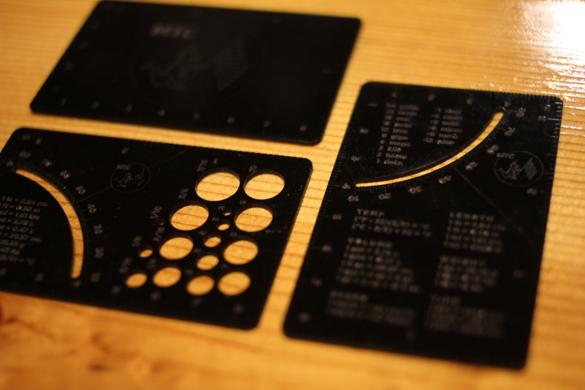
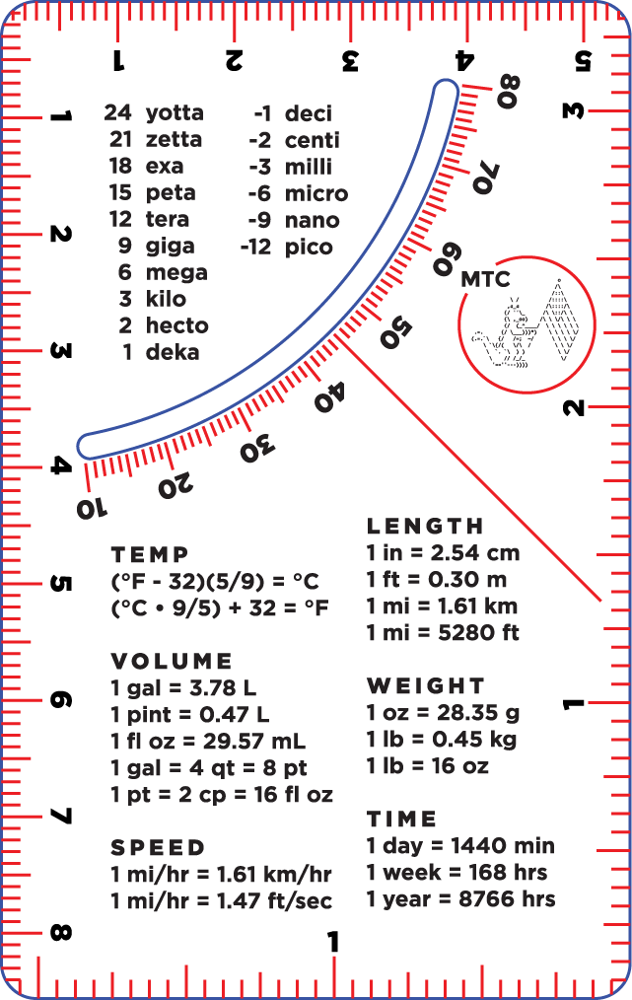
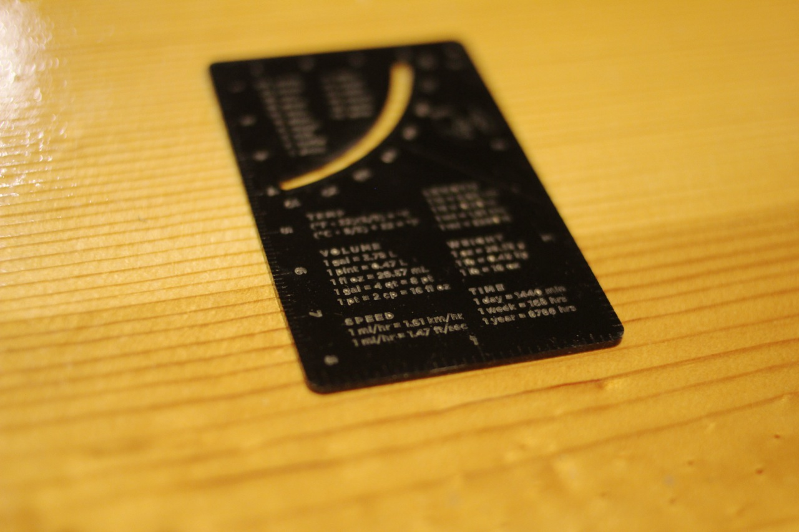
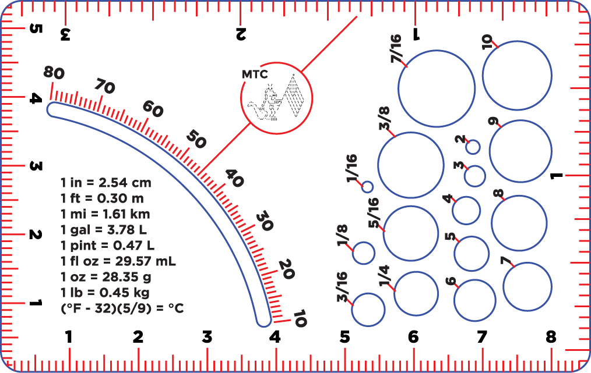
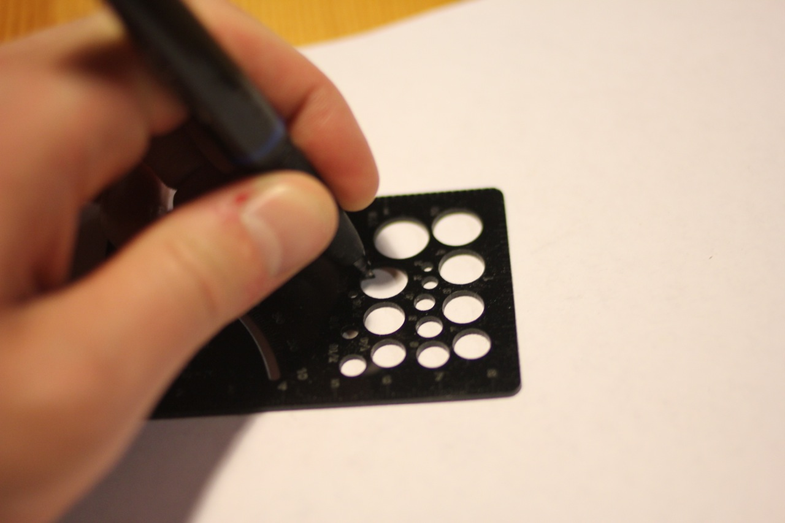
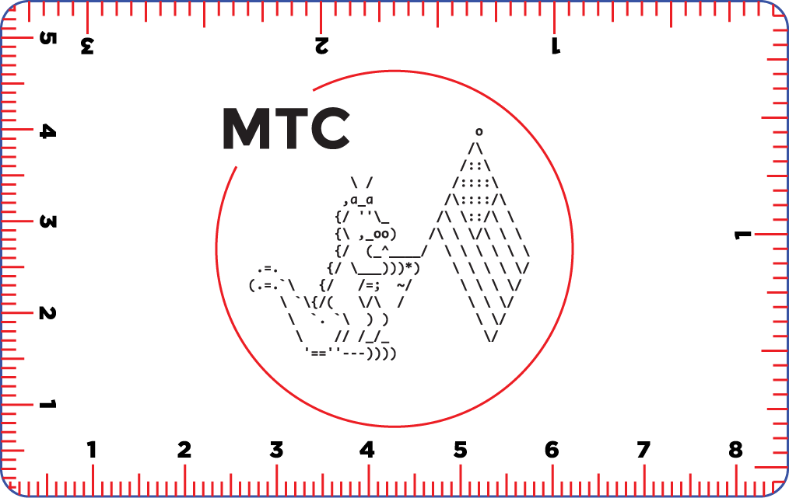
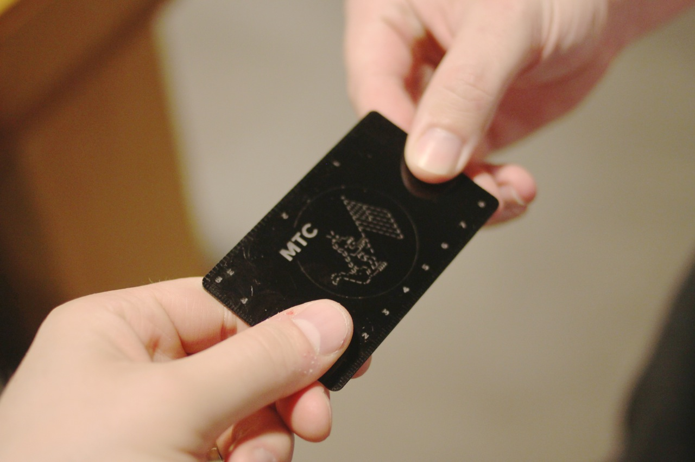
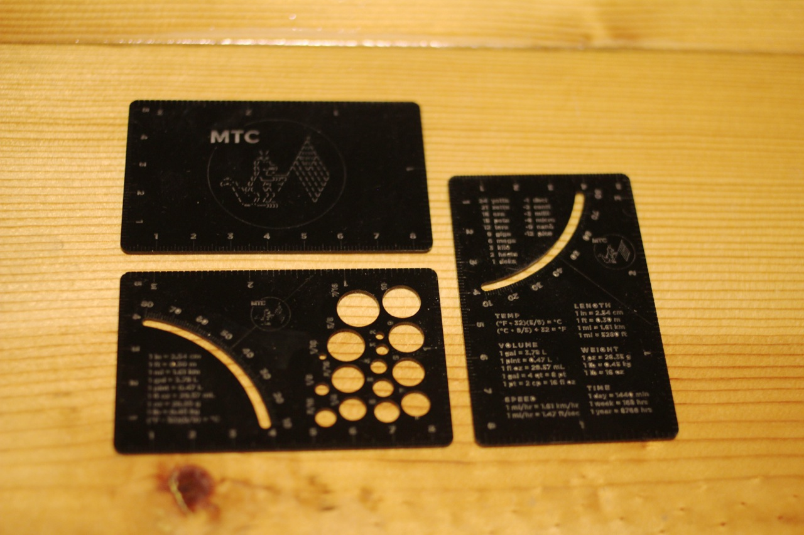

# UtilityCards
A multi-function information tool in the form factor of a credit card.

## Units
The Units card provides both Metric and Standard rulers around the perimeter of the card, as well as a small protractor. Conversion factors between Metric and Standard units for common measurements are also provided. Likewise, common SI unit prefixes are listed along with their associated powers of ten.

### Issues
- fills used for text are too thick (difficult to read), recommend reducing fill sizes
- strokes for ruler hashes are too thin (difficult to see), recommend using slightly thicker fills

## Holes
The Holes card provides both Metric and Standard rulers around the perimeter of the card, as well as a small protractor. It also contains holes for common Metric and Standard sizes. Conversion factors between Metric and Standard units for common measurements are also provided.

### Issues
- fills used for text are too thick (difficult to read), recommend reducing fill sizes
- strokes for ruler hashes are too thin (difficult to see), recommend using slightly thicker fills
- MTC logo is too small, recommend embiggening

## MTC
The MTC card is the official membership card for MTC. It provides both Metric and Standard rulers around the perimeter of the card. It also contains the MTC logo. No other information is provided. No other information is needed.

### Issues
- strokes for ruler hashes are too thin, recommend using slightly thicker fills

